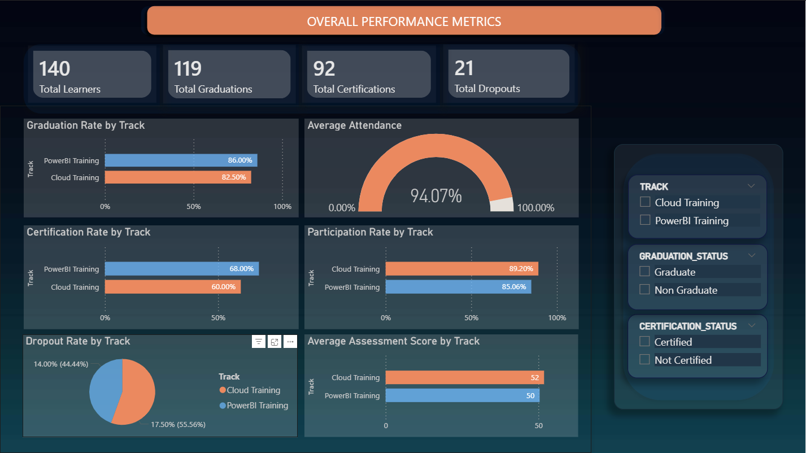
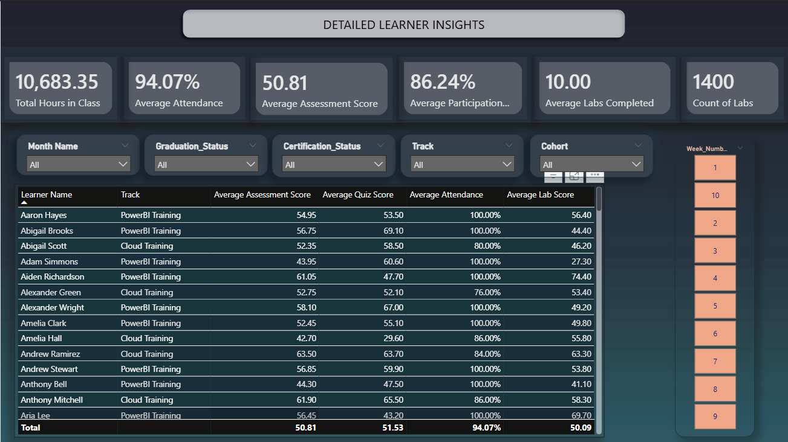

# DEM08_POWER_BI_PROJECT
# Dare Careers Student Performance Dashboard - Executive Summary

## Project Overview
This Power BI dashboard tracks student progress and performance across Dare Careers' training programs in Power BI and AWS Cloud. The solution provides program managers and trainers with real-time insights into learner engagement, assessment scores, and completion outcomes.

## Key Features

### Page 1: Overall Performance Metrics

**Summary Cards:**
- Total Learners: 140
- Total Graduations: 119 (85% graduation rate)
- Total Dropouts: 21 (15% dropout rate)
- Total Certifications: 92 (66% certification rate)

**Performance Analysis:**
- Graduation, certification, and dropout rates by track
- Average attendance and participation rates
- Average assessment scores (labs and quizzes combined)

**Interactive Filters:**
- Track (Cloud Training / PowerBI Training)
- Certification Status
- Graduation Status

### Page 2: Detailed Learner Insights

**Learner-Level Metrics:**
- Complete learner roster with email, track, and status
- Individual attendance and participation tracking
- Lab completion rates
- Total hours spent in class
- Assessment performance by learner

**Advanced Filtering:**
- Cohort selection
- Week-by-week analysis (Weeks 1-10)
- Month-based filtering
- Certification and graduation status

## Technical Implementation

**Data Sources:**
- Zoom attendance records (100 daily CSV files across 10 weeks)
- Labs and quizzes scores (weekly assessments)
- Daily participation records
- Learner status (graduation and certification)

**Data Model:**
- **Fact Tables:** Attendance, Labs, Quizzes, Participation
- **Dimension Tables:** Learner, Date, Cohort
- **Relationships:** Star schema with proper one-to-many relationships

**Key Business Rules:**
- Attendance threshold: >30 minutes per session counts as attended
- Program duration: 10 weeks, 50 class days (Monday-Friday)
- Assessment scoring: Average of labs and quizzes
- Participation rate: Days participated / Total class days

**DAX Measures (14 total):**
- Graduation/Dropout/Certification rates
- Average attendance and participation rates
- Assessment performance metrics
- Hours in class calculations
- Lab completion tracking

## Data Quality Handling

**Challenges Resolved:**
- Mixed duration formats (numeric minutes vs. time format HH:MM:SS)
- Inconsistent file naming conventions across tracks
- Participation data stored as comma-separated names
- Missing email-to-name mappings

**Solutions Implemented:**
- Smart duration parsing with format detection
- Name-to-email lookup tables
- Relationship activation for proper cross-filtering

## Scalability

The dashboard is designed to handle future cohorts automatically:
- Cohort identification based on start dates
- Dynamic date range detection
- Folder-based data ingestion for new programs
- Scheduled refresh capability for ongoing monitoring

## Key Insights

**Program Performance:**
- 85% graduation rate indicates strong program completion
- 86% average participation rate shows high engagement
- Both tracks demonstrate similar performance patterns
- Certification rate (66%) suggests opportunity for improvement in post-program certification

**Operational Value:**
- Real-time tracking of at-risk learners (low attendance/participation)
- Week-by-week performance trends for intervention planning
- Individual learner drill-down for personalized support
- Track comparison for program optimization

---

## Files Included
- `DEM08.pbix` - Power BI dashboard file
- `overall_performance_metrics.png` - Page 1 screenshot
- `detailed_learner_insights.png` - Page 2 screenshot
- `README.md` - This documentation

## Usage
1. Open `DEM08.pbix` in Power BI Desktop
2. Use slicers to filter by Track, Week, or Learner Status
3. Click on individual learners in the table for detailed metrics
4. Navigate between pages using the page navigator buttons

---

*Dashboard developed for Dare Careers training program monitoring | Data period: August - October 2024*
